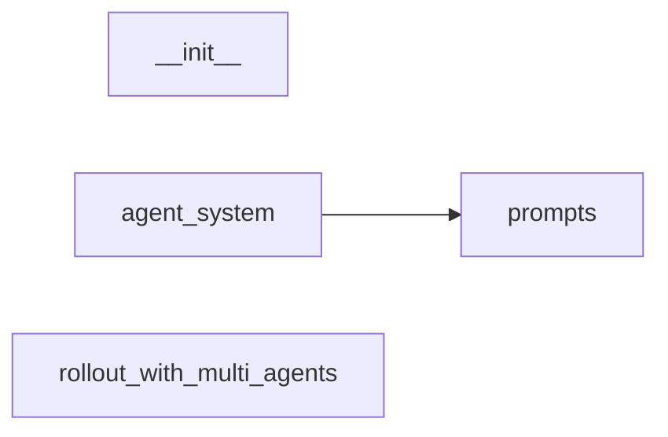

# Codebase Module Report

- Root: `/mnt/code/yehangcheng/slime/examples/multi_agent`
- Source files scanned: `4`
- Modules identified: `4`

## Structure Tree

```text
├── __init__.py
├── agent_system.py
├── prompts.py
└── rollout_with_multi_agents.py
```

## Dependency Graph



## Module Index

| Module | File | Internal deps | External deps (sample) |
|---|---|---:|---|
| `__init__` | `__init__.py` | 0 | - |
| `agent_system` | `agent_system.py` | 1 | asyncio, copy, re, slime.rollout.rm_hub, slime.utils.http_utils |
| `prompts` | `prompts.py` | 0 | - |
| `rollout_with_multi_agents` | `rollout_with_multi_agents.py` | 0 | random, slime.utils.misc, slime.utils.types, transformers |
