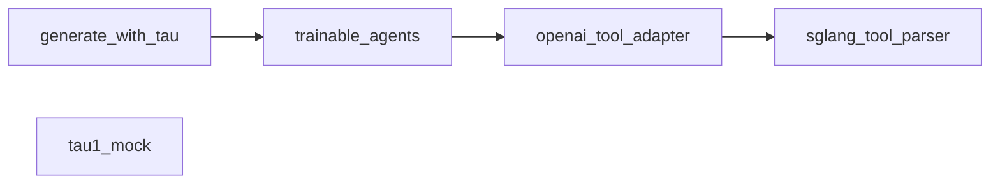

# Codebase Module Report

- Root: `/mnt/code/yehangcheng/slime/examples/tau-bench`
- Source files scanned: `5`
- Modules identified: `5`

## Structure Tree

```text
├── generate_with_tau.py
├── openai_tool_adapter.py
├── sglang_tool_parser.py
├── tau1_mock.py
└── trainable_agents.py
```

## Dependency Graph



## Module Index

| Module | File | Internal deps | External deps (sample) |
|---|---|---:|---|
| `generate_with_tau` | `generate_with_tau.py` | 1 | logging, os, slime.utils.types, tau_bench.envs, tau_bench.types |
| `openai_tool_adapter` | `openai_tool_adapter.py` | 1 | dataclasses, json, logging, tau_bench.agents.tool_calling_agent, tau_bench.types |
| `sglang_tool_parser` | `sglang_tool_parser.py` | 0 | sglang.srt.function_call.function_call_parser, sglang.srt.managers.io_struct, typing |
| `tau1_mock` | `tau1_mock.py` | 0 | argparse, json, os, tau_bench.envs, tau_bench.types |
| `trainable_agents` | `trainable_agents.py` | 1 | dataclasses, enum, json, logging, slime.rollout.sglang_rollout |
